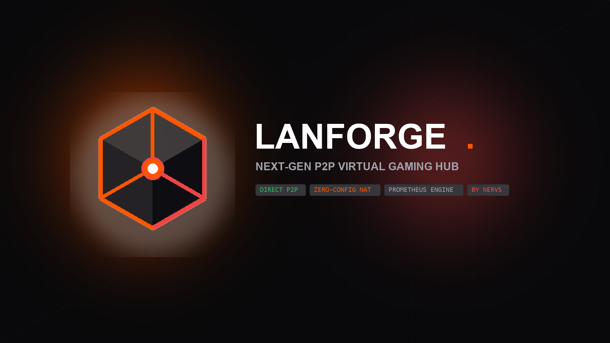

<div align="center">



# ⚡ LANFORGE

**Next-Generation P2P Virtual LAN Gaming Hub with Hardware Acceleration & Discord Rich Presence**

[](https://github.com/NERVS-DEV/LANForge/releases)
[](https://go.dev)
[](https://python.org)
[](https://github.com/NERVS-DEV/LANForge/releases)
[](LICENSE)

[**Скачать LANForge (Windows x64)**](https://github.com/NERVS-DEV/LANForge/releases/latest) • [**Быстрый старт**](#-быстрый-старт) • [**Поддерживаемые игры**](#-каталог-игр) • [**Развертывание сервера**](#-облачный-сигналинг-деплой-в-1-клик)

</div>

---

## 📖 О проекте

**LANForge** — это современная высокоскоростная замена устаревшим Hamachi, Radmin VPN и Tunngle. 
Приложение объединяет игроков в виртуальную локальную сеть через прямые **Direct UDP P2P туннели**, обеспечивая минимально возможный пинг (от 1 ms в локальной сети) и устойчивость к любым прокси, VPN и Clash Verge.

### 🌟 Ключевые возможности:
- 🚀 **Zero-Configuration Monolithic Executable:** Единый `.exe` файл (~45 МБ), содержащий в себе Go-бэкенд, аппаратный UI, Discord RPC и системный трей. Игрокам не нужны сторонние зависимости (Python/Go).
- 🎮 **Интеграция с Discord Rich Presence:** Автоматическое отображение вашего игрового статуса, названия комнаты, счетчика игроков (`3/16`) и времени сессии в профиле Discord.
- 📡 **LAN Радар (Broadcast Interceptor):** Перехват широковещательных пакетов игр (Minecraft LAN, Source Engine) и мгновенный проброс адресов с кнопкой копирования `IP:Port`.
- ⚡ **STUN Benchmark Matrix:** Встроенная диагностика задержек глобального пула STUN-серверов (Google, Cloudflare, Twilio, Nextcloud) в реальном времени.
- 🌐 **Гибридный сигналинг:** Возможность переключения между встроенным локальным сервером (`127.0.0.1:8787`), публичным облачным хабом или собственным выделенным сервером (VPS).
- 🔔 **Windows System Tray & Toasts:** Фоновая работа в системном трее Windows с нативными всплывающими уведомлениями и тактильными звуковыми сигналами.

---

## 🎮 Быстрый старт

1. **Скачайте** свежий релиз [`LANForge-v1.6.0-Windows-x64.zip`](https://github.com/NERVS-DEV/LANForge/releases/latest) или файл `LANForge.exe`.
2. **Запустите** `LANForge.exe` (двойной клик).
3. **Создание комнаты:**
   - Нажмите кнопку **«+ Создать сеть»**;
   - Выберите игровой пресет (например, *Minecraft* или *Palworld*) и скопируйте 6-значный код комнаты (например, `LAN-7842`);
   - Отправьте код друзьям.
4. **Подключение друзей:**
   - Друзья нажимают **«Войти по коду»**, вводят код комнаты и подключаются.
   - В игре введите адрес виртуального хоста (например, `10.42.0.1:25565`).

---

## 🕹️ Каталог игр (Встроенные пресеты)

| Игра | Порт | Протокол | Формат подключения |
| :--- | :---: | :---: | :--- |
| **Minecraft (Java Edition)** | `25565` | TCP | Прямое подключение -> `{HOST_IP}:25565` |
| **Terraria** | `7777` | TCP | Мультиплеер -> По IP -> `{HOST_IP}:7777` |
| **Palworld** | `8211` | UDP | Мультиплеер -> `{HOST_IP}:8211` |
| **CS / Source Games** | `27015` | UDP | В консоли: `connect {HOST_IP}:27015` |
| **Valheim** | `2456` | UDP | Join Game -> IP -> `{HOST_IP}:2456` |
| **Stardew Valley** | `24642` | UDP | Совместная игра -> По LAN |
| **Factorio** | `34197` | UDP | Сетевая игра -> Локальная сеть (LAN) |
| **Project Zomboid** | `16261` | UDP | Войти на сервер -> `{HOST_IP}:16261` |
| **Don't Starve Together** | `10999` | UDP | Просмотр игр -> Фильтр LAN |
| **Heroes of Might & Magic III**| `2300` | TCP | Мультиплеер -> TCP/IP |

---

## ☁️ Облачный сигналинг (Деплой в 1 клик)

Для игры с друзьями через Интернет вы можете развернуть собственный бесплатный сигнальный хаб на **Render.com** или любом VPS:

[](https://render.com/deploy)

Или запустите через Docker:
```bash
docker build -t lanforge-server .
docker run -d -p 8787:8787 --name lanforge-hub lanforge-server
```

---

## 🛠️ Сборка из исходного кода

### Требования:
- **Go** 1.24+
- **Python** 3.12+
- **WebView2 Runtime** (встроен в Windows 10/11)

### Сборка:
```powershell
# 1. Клонирование репозитория
git clone https://github.com/NERVS-DEV/LANForge.git
cd LANForge

# 2. Компиляция Go-бэкенда
go build -ldflags="-w -s" -o bin/lanforge-server.exe ./cmd/server

# 3. Установка зависимостей Python
pip install pyinstaller pywebview pystray pillow pythonnet clr_loader

# 4. Сборка монолитного LANForge.exe
python -m PyInstaller --noconsole --onefile --clean --name "LANForge" --icon app.ico --add-data "ui;ui" --add-data "app_icon.png;." --add-data "discord_banner.png;." --add-binary "bin/lanforge-server.exe;." --collect-all webview --collect-all pystray --collect-all PIL --collect-all clr_loader --collect-all pythonnet lanforge_gui.py --distpath ./dist
```

---

## 📄 Лицензия

Распространяется под лицензией **MIT**. Подробнее см. в файле [LICENSE](LICENSE).

<div align="center">
  <sub>Разработано <b>NERVS</b> • 2026</sub>
</div>
